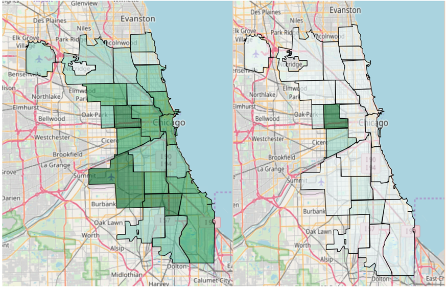
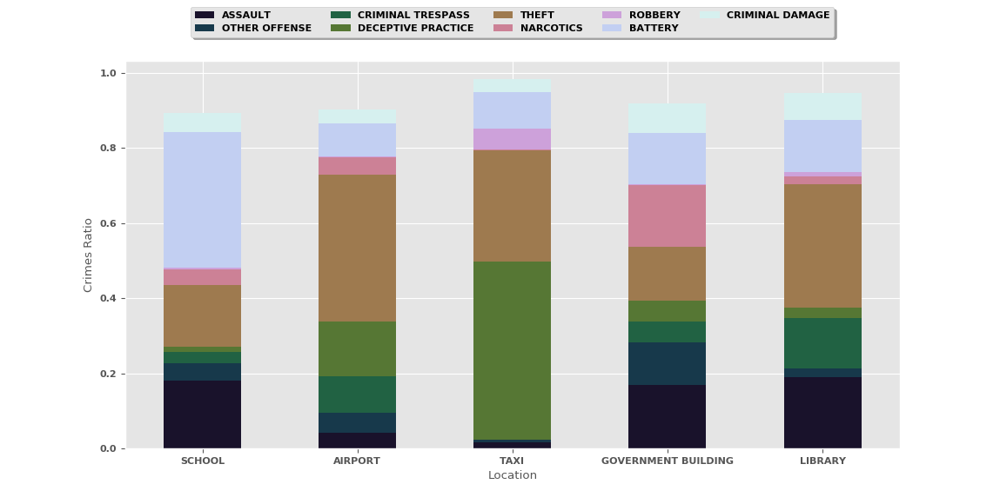

# Analyzing-Chicago-Crime-Characteristics
In this project, I aimed to analyze crime characteristics, dependencies and consequences

## Exploratory Analysis:
The first step, in my exploratory analysis, is finding the most frequent crimes in Chicago City. The crime ratio shows the popularity of a crime. Theft, Battery, criminal damages and narcotics with crime ratio of 21.07%, 18.27%, 11.4%, and 10.40% respectively are the four most popular crimes in Chicago city.

## Place-Based Analysis:
What are the potential places for each crime? By finding the potential places for each crime we can be useful for designing crime reduction and prevention strategies. For example, by finding the places that most robberies occur, we can place resources, such as officers and hidden cameras more efficiently to reduce these crimes. By initial analyzing of the Chicago crime records, I found that district one has public indecency (with placed-based crime indicator of 3215) as its first potential crime while district twenty and four have liquor law violation (with placed-based crime indicator of 953) and domestic violation (with placed-based crime indicator of 10922) respectively as the first potential crime.
 Also by grouping records based on crime types, I found that theft crimes usually occur in districts of 1, 12, 14, 18 and 19, while drug-related crimes most likely occur in districts of 10, 11 and 15. As shown in Figure 1, the crime distribution is not uniform and some districts have more recorded crimes. Also, in this figure, we can see the distribution of crime type is not uniform as well. For example, narcotics crimes occur in the city downtown.

  

Based on the Chicago crime dataset, the probability of seeing battery and narcotics crimes in the 11th district is almost two times more than other crimes in recent years, while theft is the most serious issue in district one.

## Location-Based Analysis: 
The main question may come to mind is that  what are the more common crimes in each public place? This dataset contains a location description field. Therefore, we can find which types of crime are more likely to happen in public places, such as schools or train. Thus, we can improve safety efficiently for public places. In the initial evaluation, I considered 5 public places including school, library, governmental building, airport, and taxi. As shown the in Figure, the battery is the major crime in school while deceptive practice crime is common in taxis.

  

Please read my [report](./crime_project.docx) for more informatio.
